# 클라우드 가상화 기술

## 04. 현대 네트워크 가상화 기술 실습

---

## 1. Mininet

이 실습에서는 소프트웨어로 네트워크를 정의하고 제어하는 SDN(Software-Defined Networking) 환경을 직접 구성하며, 그 출발점으로 가상 네트워크 토폴로지를 손쉽게 만들 수 있는 Mininet을 사용합니다.

`Mininet`은 가상화된 환경에서 가상의 스위치, 호스트, 링크를 생성하여 실제 네트워크 동작을 시뮬레이션하는 도구로, 물리 장비 없이도 다양한 네트워크 구조를 빠르게 실험할 수 있게 해 줍니다.

- Linux 기반 Network Namespace 활용
- 빠르고 가벼운 네트워크 토폴로지 구성 가능

---

## 2. Mininet 설치

Mininet을 사용하기 위해 먼저 필요한 패키지를 설치하고 소스 코드를 받아 설치 스크립트를 실행합니다. 아래 명령은 패키지 목록 갱신부터 설치 확인까지 한 번에 진행합니다.

```bash
# 패키지 업데이트
sudo apt-get update

# 필수 패키지 설치
sudo apt-get install -y git python3-pip openvswitch-switch

# Mininet 소스코드 클론
git clone https://github.com/mininet/mininet

# 설치 스크립트 실행
cd mininet

# Mininet 설치
sudo ./util/install.sh -a

# 설치 확인
mn --version
```

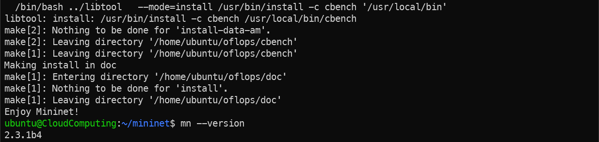

---

## 3. POX 컨트롤러

SDN에서는 네트워크의 제어 로직을 담당하는 컨트롤러가 핵심 역할을 합니다. 여기서는 스위치와 컨트롤러가 통신하는 표준 프로토콜인 OpenFlow를 기반으로 동작하는 POX 컨트롤러를 사용합니다.

`POX`는 Python 기반의 `OpenFlow 컨트롤러`로 학습 및 프로토타이핑에 적합

- `OpenFlow 기반 SDN 컨트롤러`
- 가볍고 사용이 간단

---

## 4. POX 설치

POX 컨트롤러를 내려받고 정상적으로 실행되는지 확인합니다. Mininet 설치 과정에 이미 포함되어 있는 경우 별도 클론은 생략할 수 있습니다.

```bash
# 홈 디렉토리에서 POX 클론
cd ~
git clone https://github.com/noxrepo/pox
# Mininet 설치 시 이미 포함되어 있어 별도로 하지 않아도 됨

# 실행 테스트
cd ~/pox
./pox.py -h
```

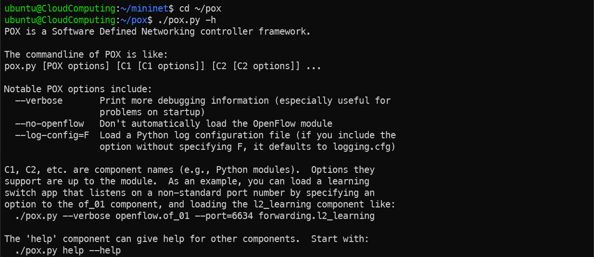

---

## 5. Mininet 기본 실행

설치가 끝났으면 가장 간단한 토폴로지를 실행해 Mininet이 정상 동작하는지 확인합니다. minimal 토폴로지는 스위치 1개와 호스트 2개로 이루어진 기본 구성입니다.

```bash
# 최소 토폴로지 실행
sudo mn --topo minimal
```

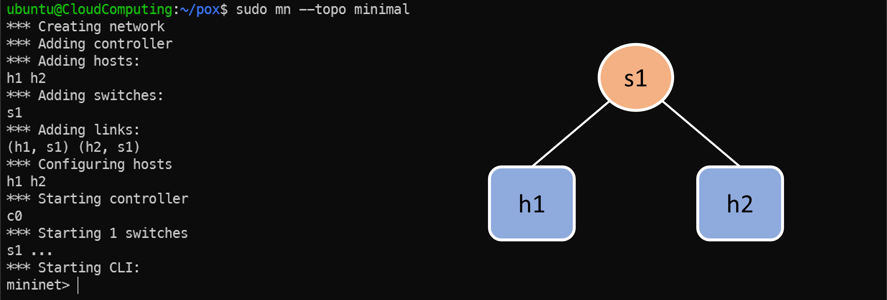  

---

## 6. Tree 토폴로지 생성

여러 스위치와 호스트가 계층적으로 연결된 환경을 만들기 위해 Tree 토폴로지를 생성합니다. depth와 fanout 값을 조절해 트리의 깊이와 분기 수를 자유롭게 바꿀 수 있습니다.

```bash
# Tree 구조 토폴로지 생성
# depth: 트리의 깊이
# fanout: 각 스위치의 하위 호스트 수
sudo mn --topo tree,depth=2,fanout=2
```

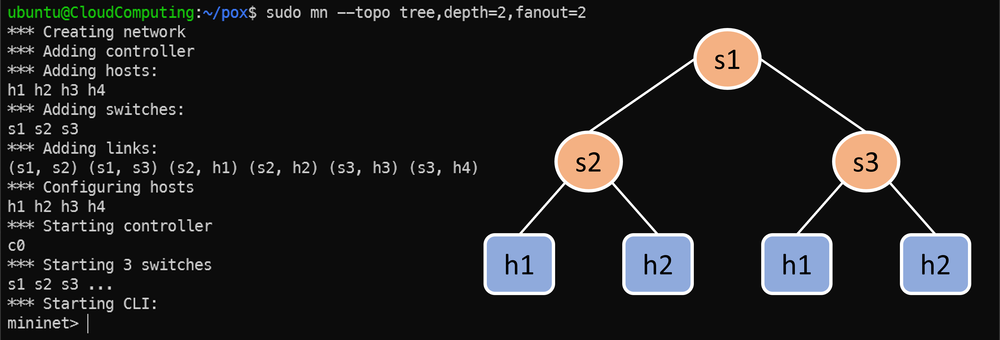

---

## 7. Mininet CLI 명령어

Mininet을 실행하면 `mininet>` 프롬프트가 제공되며, 여기서 각 호스트에 명령을 내려 연결 상태나 네트워크 설정을 확인할 수 있습니다. 호스트 이름 뒤에 일반 리눅스 명령을 붙이면 해당 호스트에서 실행됩니다.

```bash
# Mininet CLI에서 실행
mininet> h1 ping -c 1 h2
mininet> h2 ping -c 3 h4
mininet> h3 ip a
mininet> h4 ip route
```

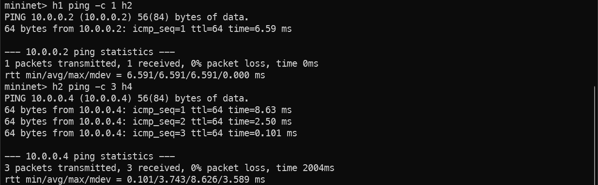
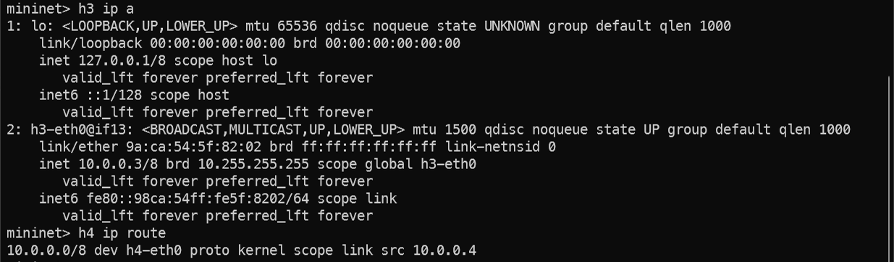

---

## 8. 호스트에서 Mininet 내부 네트워크 정보 확인

Mininet의 각 호스트는 별도의 Network Namespace로 격리되어 있습니다. 호스트 OS에서 해당 네임스페이스로 진입하면 가상 호스트가 보는 네트워크 정보를 직접 확인할 수 있습니다.

```bash
# 호스트에서 실행
ps -ef | grep mininet

# mininet의 PID를 통해 h3 네트워크 네임스페이스 네트워크 정보 확인
sudo nsenter -t <h3 PID> -n ip a
```

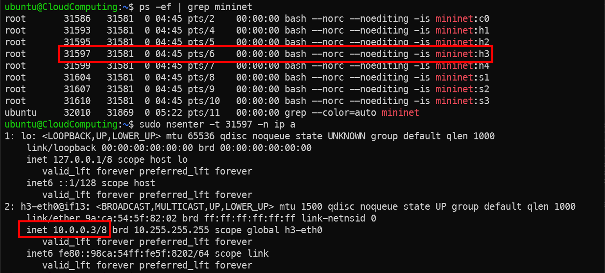

### s1, s2, s3 간 연결 관계 확인

Mininet의 스위치는 Open vSwitch(OVS)로 구현됩니다. OVS 정보와 인터페이스 목록을 함께 살펴보면 스위치들이 서로 어떻게 연결되어 있는지 파악할 수 있습니다.

```bash
# OVS 스위치 정보 확인
sudo ovs-vsctl show

# 인터페이스 정보 확인
ip a | grep s
```
`ovs-vsctl show와 ip a 결과를 비교하면 스위치 간 인터페이스 연결 관계를 확인할 수 있음`

---

## 9. POX 실행

이제 POX 컨트롤러를 실행해 스위치에 제어 로직을 제공합니다. 여기서는 MAC 주소를 학습해 패킷을 전달하는 L2 Learning 스위치 모듈을 디버그 로그와 함께 실행합니다.

```bash
cd ~/pox

# L2 Learning 스위치 실행
./pox.py log.level --DEBUG forwarding.l2_learning
```

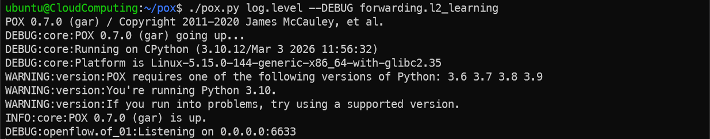

---

## 10. Mininet에서 컨트롤러 연결

POX가 실행 중인 상태에서 Mininet을 외부 컨트롤러(remote)에 연결합니다. 스위치는 지정한 IP와 포트로 컨트롤러에 접속해 OpenFlow로 제어 명령을 주고받습니다.

```bash
sudo mn --topo single,3 \
--controller=remote,ip=127.0.0.1,port=6633
```

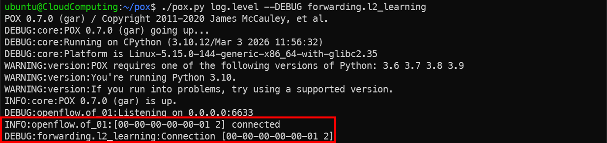

---

## 11. L2 Learning 모듈 동작

컨트롤러가 패킷을 어떻게 처리하는지 이해하기 위해 L2 Learning 모듈의 동작을 살펴봅니다. 이 모듈은 스위치로 들어온 패킷의 출발지 MAC을 학습해 두었다가, 목적지를 알면 해당 포트로만 전달하고 모르면 전체 포트로 내보내는 방식으로 동작합니다.

경로: `~/pox/pox/forwarding/l2_learning.py`

### 주요 동작

- PacketIn 이벤트 발생 시 처리
- MAC 주소 학습
- 목적지 MAC 확인 후 forwarding 수행

```python
# MAC 학습
self.macToPort[packet.src] = event.port
```

### 동작 흐름

- 목적지 MAC 존재 → 유니캐스트 전달 (FlowMod)
- 목적지 MAC 없음 → Flood 처리 (PacketOut)
- Flow 설치 후 스위치에서 직접 처리 가능

### h1에서 h3로 ping 테스트

실제로 호스트 간 통신을 일으켜 컨트롤러가 설치한 Flow가 스위치에 반영되는지 확인합니다. ping 이후 Flow Table을 조회하면 학습된 규칙을 볼 수 있습니다.

```bash
h1 ping -c 3 h3

# Flow Table 확인
sudo ovs-ofctl dump-flows s1
```

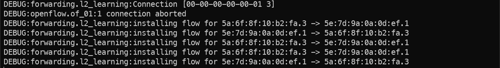  
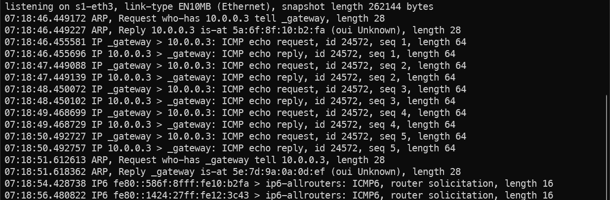
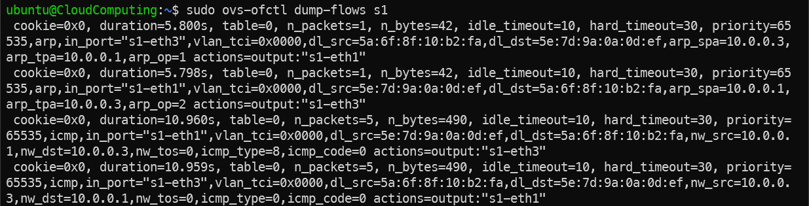
`Flow가 어떻게 학습되는지 직접 확인해 봅니다.`

---

## 12. OVS 스위치 정보 확인

스위치의 포트 구성, 설치된 Flow 규칙, 포트별 통계 등을 확인해 네트워크가 의도대로 동작하는지 점검합니다.

```bash
# OVS 스위치 정보 확인

# s1 스위치의 포트와 연결 상태 확인
sudo ovs-ofctl show s1

# Flow Table 확인
# 트래픽이 없으면 빈 테이블이지만, ping 테스트 후에는 학습된 Flow가 보임
sudo ovs-ofctl dump-flows s1

# Port 정보 확인
sudo ovs-ofctl dump-ports s1
```

---

## 13. 방화벽 구현

컨트롤러가 패킷을 직접 제어한다는 점을 활용하면, 특정 트래픽을 통과시키지 않는 간단한 방화벽을 만들 수 있습니다. 앞서 살펴본 `l2_learning` 모듈을 기반으로 차단 규칙을 추가해 봅니다.

`l2_learning` 코드를 기반으로 특정 트래픽 차단 구현
- 특정 트래픽(출발지 MAC/IP, 목적지 MAC/IP, 포트 등)에 대한 차단 규칙을 적용
- 편의상, 코드에 차단 규칙을 하드 코딩해도 됨
- ~/pox/pox/forwarding/l2_learning.py 파일에서 PacketIn 이벤트 처리 부분 수정


### 방법 1

- 특정 트래픽이 들어오면 `PacketOut`, `FlowMod` 메시지 없이 패킷 드랍 
- [예시코드](./codes/l2_learning_1.py) s1 - h1, h2, h3, h4 구조일 때

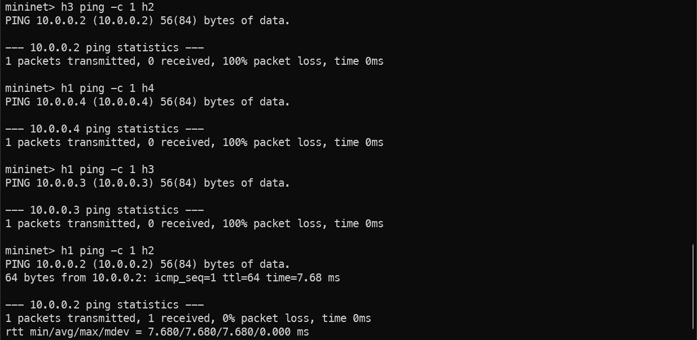
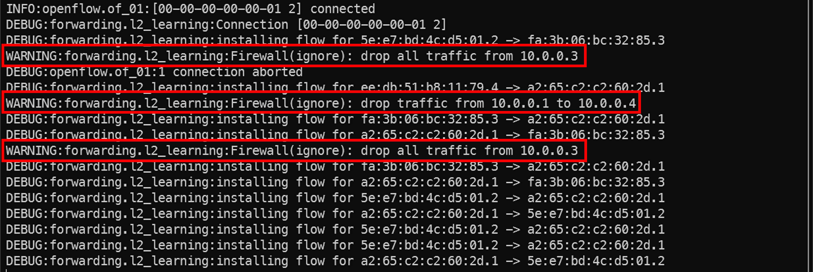

### 방법 2

- 특정 트래픽이 들어오면 패킷 드랍과 동시에 차단을 위한 `FlowMod` 메시지 생성하여 설치하기
- [예시코드](./codes/l2_learning_2.py) s1 - h1, h2, h3, h4 구조일 때

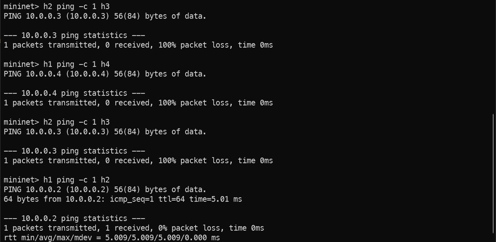
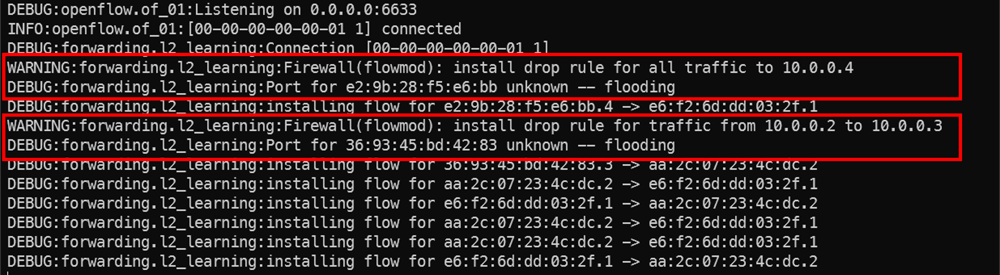
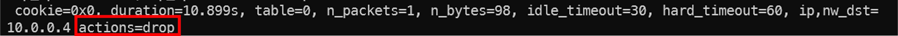
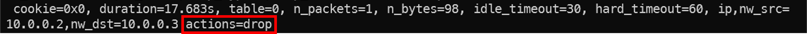

---

## 14. ONOS 컨트롤러

POX가 학습용 경량 컨트롤러라면, ONOS는 실제 운영 환경을 겨냥한 대규모 SDN 컨트롤러입니다. 이어지는 실습에서는 ONOS를 사용해 더 현실적인 SDN 환경을 다뤄 봅니다.

`ONOS`는 오픈소스 SDN 컨트롤러로 대규모 네트워크 환경에 적합

- OpenFlow 기반 SDN 컨트롤러
- Web UI 및 REST API 제공

---

## 15. Docker 설치 및 ONOS 실행

ONOS는 컨테이너 이미지로 손쉽게 실행할 수 있으므로, 먼저 Docker를 설치한 뒤 ONOS 컨테이너를 띄웁니다. 아래 명령은 Docker 저장소 등록부터 설치 확인까지 진행합니다.

```bash
# 필수 패키지 설치
sudo apt-get update
sudo apt-get install -y ca-certificates curl gnupg

# Docker GPG 키 추가
sudo install -m 0755 -d /etc/apt/keyrings
curl -fsSL https://download.docker.com/linux/ubuntu/gpg | sudo gpg --dearmor -o /etc/apt/keyrings/docker.gpg
sudo chmod a+r /etc/apt/keyrings/docker.gpg

# Docker 저장소 추가
echo "deb [arch=$(dpkg --print-architecture) signed-by=/etc/apt/keyrings/docker.gpg] https://download.docker.com/linux/ubuntu $(. /etc/os-release && echo "$VERSION_CODENAME") stable" | sudo tee /etc/apt/sources.list.d/docker.list > /dev/null

# Docker 설치
sudo apt-get update
sudo apt-get install -y docker-ce docker-ce-cli containerd.io

sudo systemctl start docker
sudo systemctl enable docker

# sudo 없이 docker 사용 (선택사항)
sudo usermod -aG docker $USER
newgrp docker

# 도커 설치 확인
docker --version
```

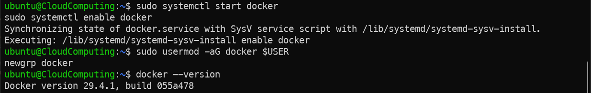

Docker가 준비되면 ONOS 컨테이너를 실행하고, 컨트롤러가 완전히 기동될 때까지 로그를 확인합니다.

```bash
# ONOS 실행
docker run -d --net=host --name onos onosproject/onos:2.1.0

# 로그 확인 (ONOS 완전히 뜰 때까지 대기)
docker logs -f onos
```

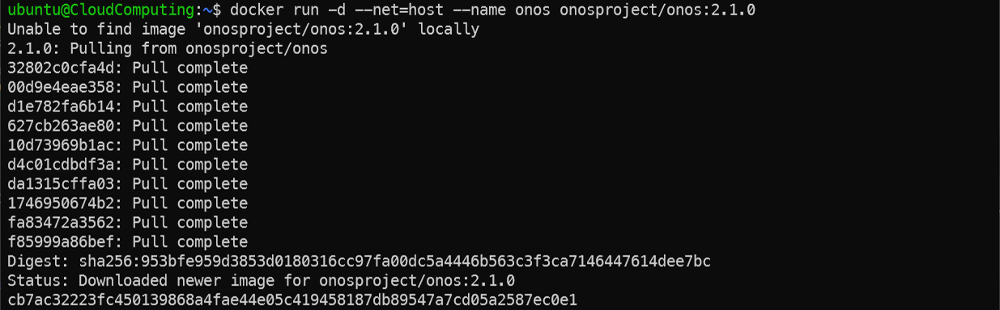
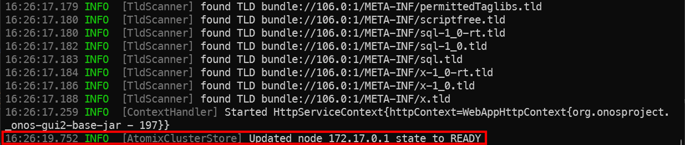

### 참고

`--net=host` 옵션으로 컨테이너를 호스트 네트워크 스택에 직접 연결하므로 별도 포트 매핑 없이 ONOS가 사용하는 포트가 그대로 열림

```bash
docker inspect --format='{{range $p, $conf := .Config.ExposedPorts}}{{$p}}{{end}}' onos
```

- `8181` - Web UI
- `6653` - OpenFlow
- `8101` - ONOS CLI

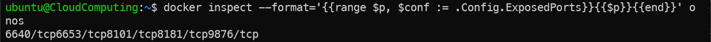

---

## 16. Mininet에서 ONOS 연결

ONOS가 기동되면 웹 UI에 접속해 필요한 앱을 활성화하고, Mininet 토폴로지를 ONOS 컨트롤러에 연결합니다. 이렇게 하면 Mininet의 가상 스위치들이 ONOS의 제어를 받게 됩니다.

브라우저에서 접속:
```
http://<IP주소>:8181/onos/ui/login.html
```
계정: `onos / rocks`

**앱 활성화 (Applications 탭에서)**
- `OpenFlow Provider Suite` → Activate
- `Reactive Forwarding` → Activate

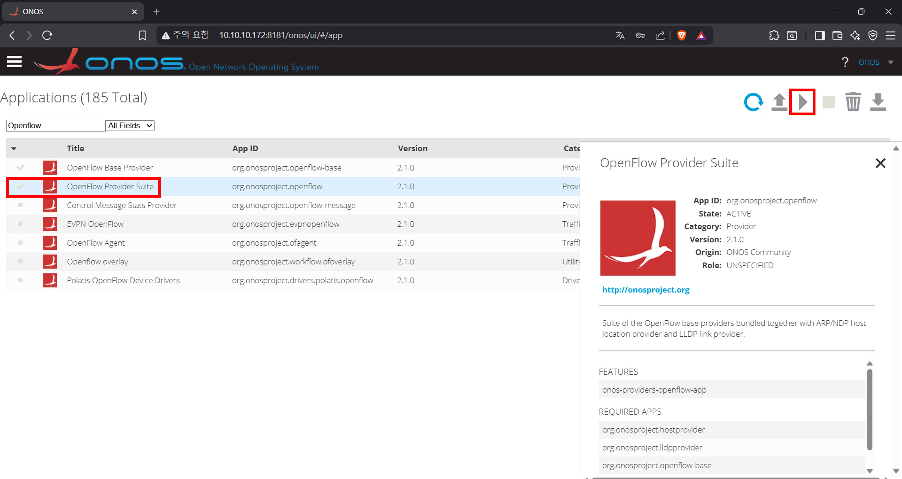
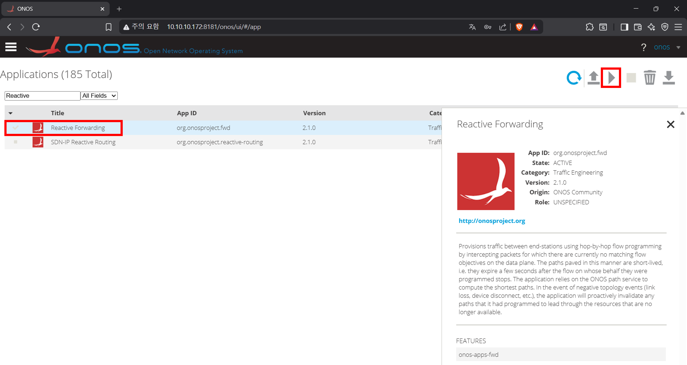


```bash
# Mininet 실행 (ONOS 컨트롤러와 연결)
# Tree 토폴로지: 깊이 2, 스위치당 하위 노드 3개 (스위치 4개, 호스트 9개)
# hostname -I : 호스트의 IP 주소 확인 | awk '{print $1}' : 첫 번째 IP 주소만 추출(ens3 인터페이스의 IP)
sudo mn --topo tree,depth=2,fanout=3 \
  --controller=remote,ip=$(hostname -I | awk '{print $1}'),port=6653 \
  --switch ovs,protocols=OpenFlow13
```

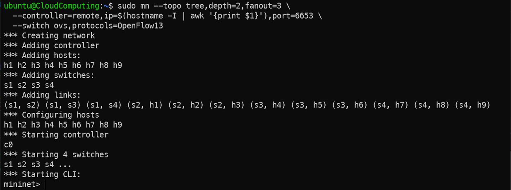

---

## 17. ONOS 동작 확인

ONOS가 토폴로지를 제대로 인식하고 Flow를 설치하는지 확인합니다. 웹 UI의 Topology 화면, OVS의 Flow Table, ONOS CLI, REST API를 차례로 활용해 같은 정보를 여러 관점에서 살펴봅니다.

### 토폴로지 확인

- ONOS UI 좌측 메뉴 → **Topology** 에서 스위치/호스트 연결 확인

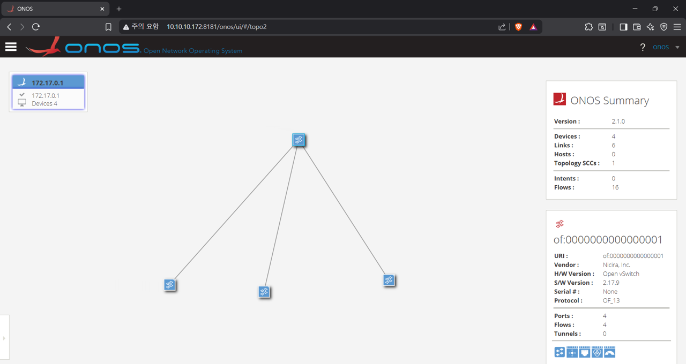

```bash
# pingall 명령어를 통해 호스트 간 연결 확인
# 호스트 간 연결이 성공하면 ONOS UI에서 Flow가 설치되는 것을 확인할 수 있음(웹UI에서 H 입력 시 호스트 출력)
mininet> pingall
```

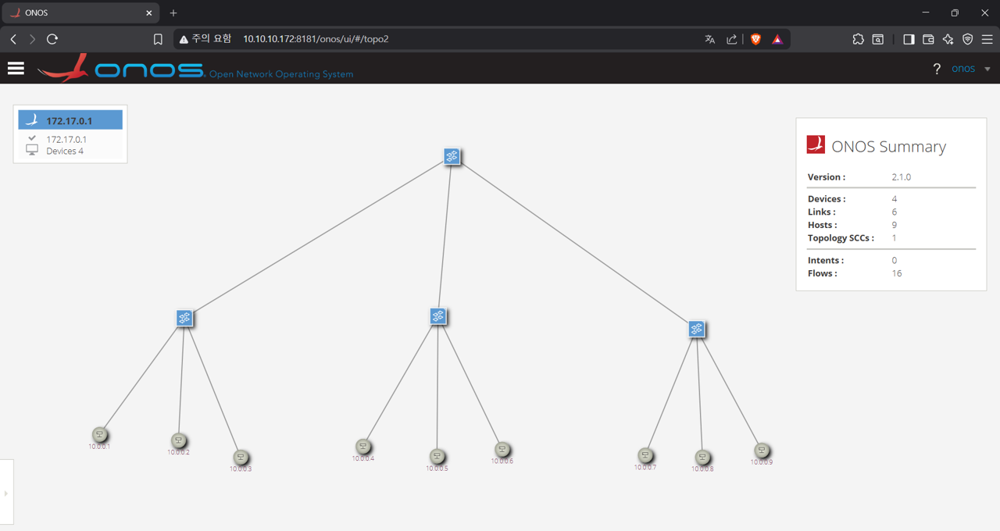

### Flow Table 확인

```bash
# OVS에서 Flow 확인
sudo ovs-ofctl -O OpenFlow13 dump-flows s1
```

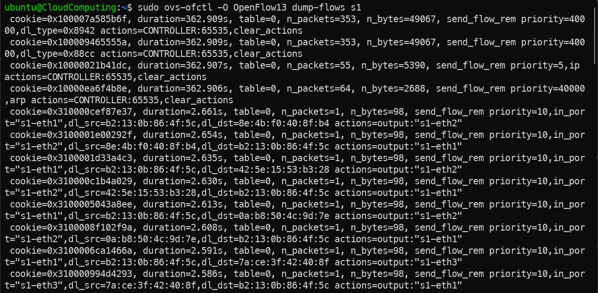

```bash
# ONOS CLI 접속
docker exec -it onos /root/onos/apache-karaf-4.2.3/bin/client -h localhost

# karaf@root에서
# ONOS에 연결된 스위치 목록 확인
flows

# 학습된 호스트(MAC/IP) 목록 확인
hosts

# 스위치에 설치된 Flow 규칙 목록 확인
devices
```

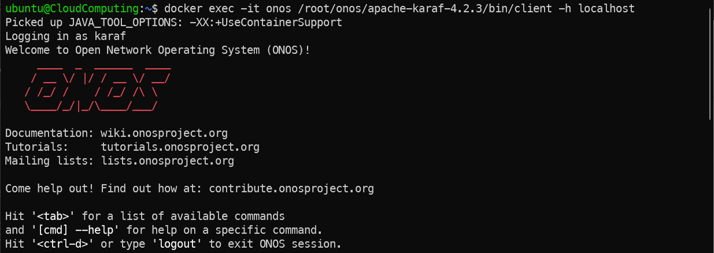
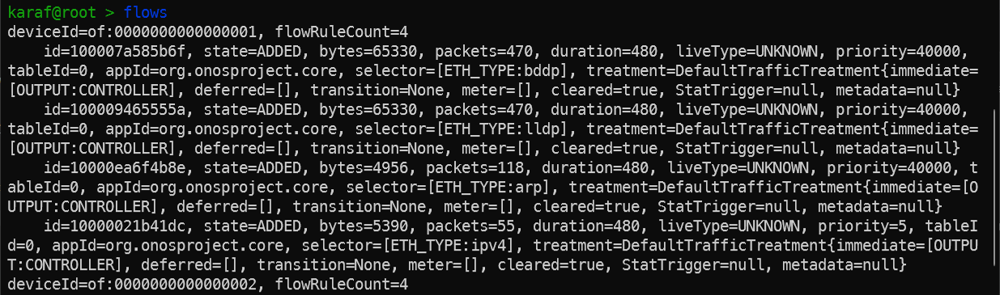
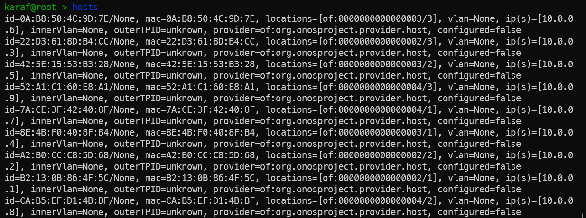
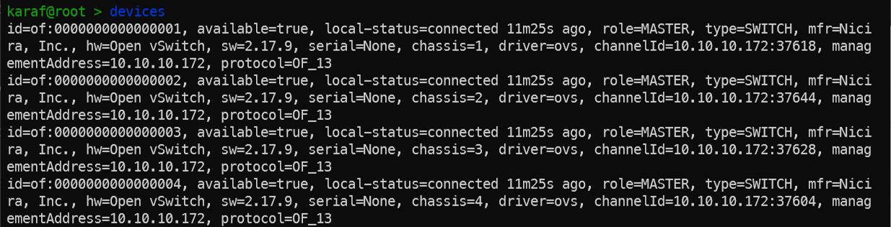

```bash
# REST API로 Flow 조회
curl -u onos:rocks \
  http://localhost:8181/onos/v1/flows | python3 -m json.tool
```

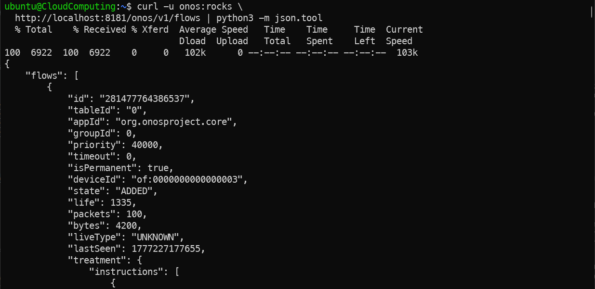

---

## 18. ONOS 방화벽 구현

ONOS는 REST API를 통해 Flow 규칙을 직접 설치할 수 있습니다. 이를 이용해 특정 출발지에서 특정 목적지로 향하는 트래픽을 차단하는 규칙을 스위치에 내려보냅니다.

REST API로 특정 트래픽 차단 Flow 직접 설치

```bash
# h1(10.0.0.1) → h3(10.0.0.3) 차단 Flow 설치
# h1, h3가 연결된 스위치에 Flow 규칙 설치 (hosts 명령어로 확인, 예시에서는 s2) | deviceId 및 주소의 마지막 of 아래에 스위치 ID 입력
curl -v -u onos:rocks -X POST \
  -H 'Content-Type: application/json' \
  -d '{
    "priority": 50000,
    "timeout": 0,
    "isPermanent": true,
    "deviceId": "of:0000000000000002",
    "treatment": {"instructions": []},
    "selector": {
      "criteria": [
        {"type": "ETH_TYPE", "ethType": "0x800"},
        {"type": "IPV4_SRC", "ip": "10.0.0.1/32"},
        {"type": "IPV4_DST", "ip": "10.0.0.3/32"}
      ]
    }
  }' \
  http://localhost:8181/onos/v1/flows/of:0000000000000002

# 차단 확인
mininet> h1 ping -c 3 h3
```

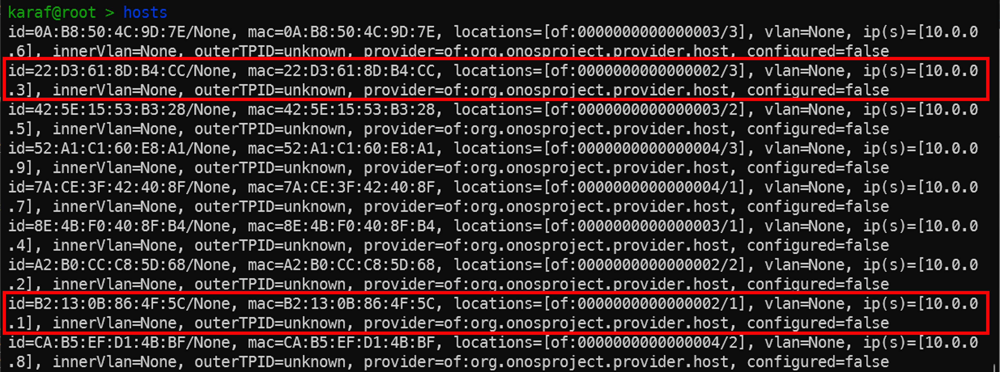
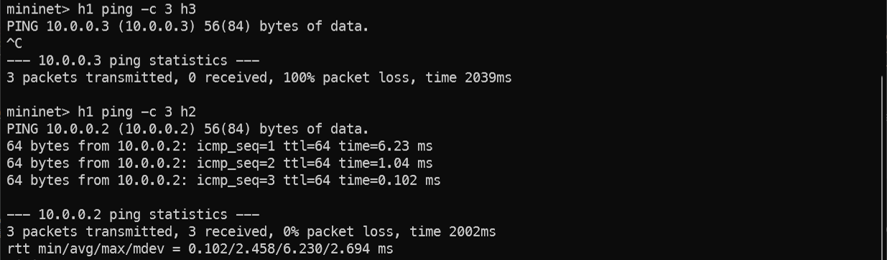

```bash
# 설치된 Flow 확인
# of 아래에 스위치 ID 입력(없어도 전체 Flow 조회는 가능)
curl -u onos:rocks \
  http://localhost:8181/onos/v1/flows/of:0000000000000002 | python3 -m json.tool
# http://localhost:8181/onos/v1/flows/
``` 


### 참고

Mininet 호스트는 Linux Network Namespace로 격리되어 있어 트래픽이 외부로 나가지 않음. ONOS가 설치하는 Flow는 Mininet 내부 가상 OVS 스위치 안에서만 처리됨

---

## 19. 기타 SDN 컨트롤러

POX와 ONOS 외에도 다양한 SDN 컨트롤러가 있습니다. 필요에 따라 아래 컨트롤러들도 살펴보면 좋습니다.

### Ryu

- https://github.com/faucetsdn/ryu

### OpenDayLight

- https://docs.opendaylight.org/en/latest/getting-started-guide/installing_opendaylight.html

---

## 20. 심화 과제 - 로드 밸런서 구현

지금까지 익힌 컨트롤러 기반 트래픽 제어를 응용한 심화 주제입니다. 여러 서버에 트래픽을 분산시키는 로드 밸런서를 직접 구현해 보면서 SDN의 활용 가능성을 넓혀 봅니다.

`라운드 로빈 방식으로 서버를 번갈아 선택하는 로드밸런서를 구현해 봅니다.`


---

## Q & A

박찬욱  
cupark@dankook.ac.kr

남재현  
namjh@dankook.ac.kr  

## Networked Systems and Security Lab (BoanLab) @ DKU
