# 클라우드 가상화 기술

## 05. 네트워크 가상화 기술 실습

---

## 1. Network Namespace를 이용한 가상 네트워크 구성

이번 실습에서는 컨테이너 네트워크의 기반이 되는 `Network Namespace`를 직접 다뤄, 하나의 호스트 안에 격리된 가상 네트워크를 구성하고 외부와 통신하는 과정을 단계별로 살펴봅니다.

Linux의 `Network Namespace(Network NS)`는 네트워크 스택을 격리하는 커널 기능으로, 이를 이용하면 하나의 호스트 내부에 여러 개의 독립적인 네트워크 환경을 구성할 수 있습니다.

각 Namespace는 다음 요소를 독립적으로 보유합니다.

- 네트워크 인터페이스
- IP 주소
- 라우팅 테이블
- ARP 테이블
- 방화벽 규칙

이를 통해 컨테이너와 유사한 격리된 네트워크 환경을 구성할 수 있습니다.

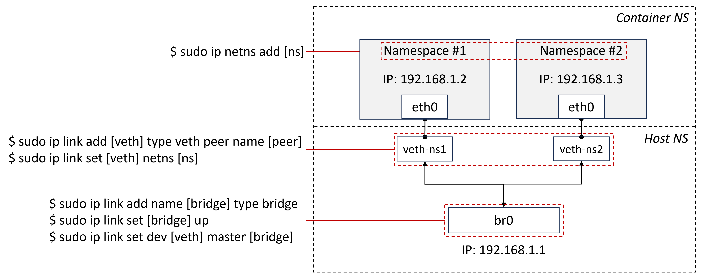

---

## 2. 네트워크 네임스페이스 생성

먼저 격리된 네트워크 환경의 단위가 될 네임스페이스를 생성합니다. 여기서는 두 개의 네임스페이스(`ns1`, `ns2`)를 만들어 이후 서로 통신하도록 구성합니다.

### 네임스페이스 생성

```bash
# 새 네트워크 네임스페이스 생성
sudo ip netns add ns1

sudo ip netns add ns2
```

### 생성된 네트워크 네임스페이스 확인

```bash
# network Namespace 목록 확인
ip netns list
```

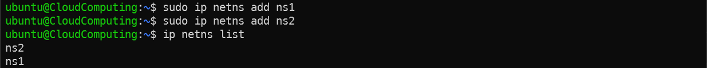

### 참고
- `ip netns delete <네임스페이스>` 명령어로 네임스페이스 삭제 가능  

- 네임스페이스 삭제 시 해당 네임스페이스에 속한 인터페이스와 설정도 함께 제거됨

---

## 3. 브릿지 생성

여러 네임스페이스를 서로 연결하려면 이들을 묶어 줄 가상 스위치가 필요합니다. `Linux Bridge`는 호스트 내부에서 동작하는 소프트웨어 스위치로, 연결된 인터페이스들이 같은 L2 네트워크에 속한 것처럼 통신하게 해 줍니다.

```bash
# 네임스페이스 간 연결을 위한 Linux Bridge 생성
sudo ip link add name br0 type bridge

# 브릿지 인터페이스 활성화
sudo ip link set br0 up
```

### 브릿지 생성 여부 확인

```bash
# br0 브릿지 인터페이스 확인
ip link show | grep br0
```

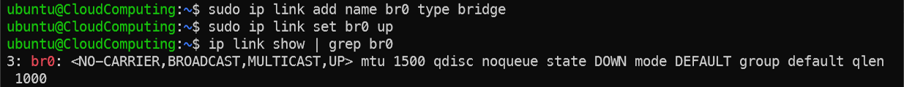

---

## 4. veth Pair 생성

네임스페이스를 브릿지에 연결하려면 가상의 네트워크 케이블 역할을 하는 인터페이스가 필요합니다. `veth pair`는 서로 연결된 두 개의 가상 인터페이스로, 한쪽으로 들어온 패킷이 다른 쪽으로 그대로 전달됩니다. 한쪽은 호스트(브릿지)에, 다른 쪽은 네임스페이스에 연결하여 통로를 만듭니다.

```bash
# 네임스페이스와 브릿지 연결을 위한 veth pair 생성
# veth pair는 서로 연결된 두 개의 가상 네트워크 인터페이스
sudo ip link add veth1 type veth peer name veth-ns1

sudo ip link add veth2 type veth peer name veth-ns2
```

### 생성된 veth 인터페이스 확인

```bash
# 생성된 veth 인터페이스 확인
ip link show | grep veth-
```

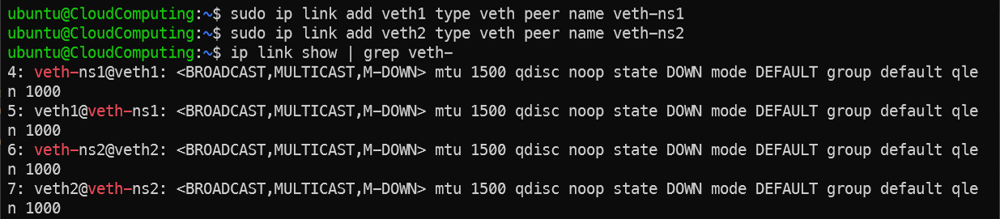

---

## 5. 브릿지와 veth 연결

앞서 만든 `veth pair`의 호스트 쪽 인터페이스를 브릿지에 연결하여 네임스페이스가 브릿지를 통해 통신할 수 있도록 합니다. 연결 후에는 해당 인터페이스를 활성화해야 실제로 패킷이 오갈 수 있습니다.

### brctl 설치

`brctl`은 `bridge-utils` 패키지에 포함된 브릿지 관리 도구입니다.

```bash
# bridge-utils 패키지 설치
sudo apt install bridge-utils
```

### 브릿지와 호스트쪽 veth-ns 인터페이스 연결

```bash
# veth 인터페이스를 Linux Bridge에 연결
sudo brctl addif br0 veth-ns1
sudo brctl addif br0 veth-ns2
```

### 인터페이스 활성화

```bash
# 브릿지에 연결된 veth 인터페이스 활성화
sudo ip link set dev veth-ns1 up
sudo ip link set dev veth-ns2 up
```

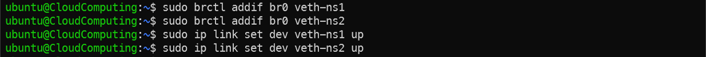

---

## 6. veth 인터페이스를 Namespace로 이동

`veth pair`의 나머지 한쪽 끝을 각 네임스페이스 내부로 옮겨 네임스페이스가 자신만의 네트워크 인터페이스를 갖도록 합니다. 이동하면서 인터페이스 이름을 일반적인 `eth0`로 변경합니다.

```bash
# veth1을 ns1으로 보내면서 이름을 eth0로 변경
sudo ip link set veth1 netns ns1 name eth0

# veth2를 ns2로 보내면서 이름을 eth0로 변경
sudo ip link set veth2 netns ns2 name eth0

# veth1, veth2 인터페이스가 호스트 네임스페이스에서 사라졌는지 확인
ip link show | grep veth-
```

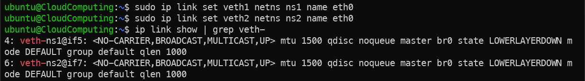

```bash
# ns1 네임스페이스 안에 eth0 인터페이스가 있는지 확인
sudo ip netns exec ns1 ip link show

# ns2 네임스페이스 안에 eth0 인터페이스가 있는지 확인
sudo ip netns exec ns2 ip link show
```

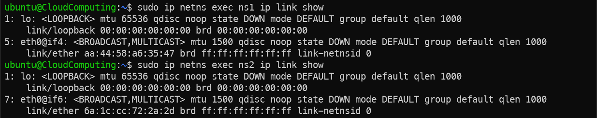

### 참고
- `ip link set <인터페이스> netns <네임스페이스>` 명령어로 인터페이스를 네임스페이스로 이동  
(네임스페이스 -> 호스트도 가능)  

- `name <새 이름>` 옵션으로 네임스페이스 내부에서 인터페이스 이름 변경 가능  

- 네임스페이스로 이동한 인터페이스는 해당 네임스페이스 내부에서만 보이고 사용할 수 있음

---

## 7. Namespace 내부 네트워크 설정

이제 각 네임스페이스 내부의 `eth0` 인터페이스에 IP 주소를 부여하고 인터페이스를 활성화합니다. 두 네임스페이스가 같은 브릿지를 통해 통신하도록 동일한 서브넷(`192.168.1.0/24`)에 서로 다른 IP를 할당합니다.

```bash
# ns1 내부 eth0 인터페이스 IP 설정
sudo ip netns exec ns1 ip addr add 192.168.1.2/24 dev eth0

# eth0 인터페이스 활성화
sudo ip netns exec ns1 ip link set dev eth0 up

# loopback 인터페이스 활성화
sudo ip netns exec ns1 ip link set lo up

# IP 주소 설정 및 활성화가 제대로 되었는지 확인
sudo ip netns exec ns1 ip a
```

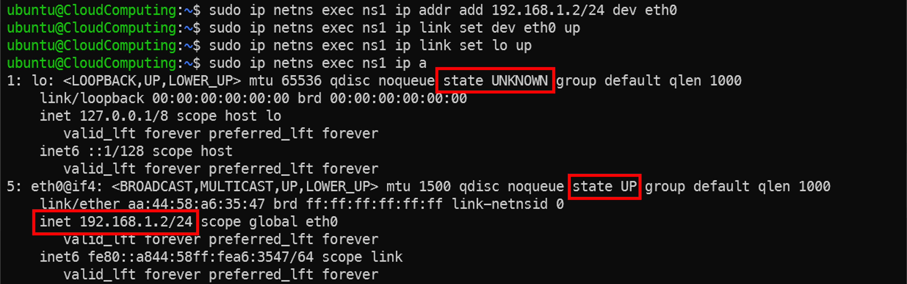

```bash
# ns2 내부 eth0 인터페이스 IP 설정
sudo ip netns exec ns2 ip addr add 192.168.1.3/24 dev eth0

# eth0 인터페이스 활성화
sudo ip netns exec ns2 ip link set dev eth0 up

# loopback 인터페이스 활성화
sudo ip netns exec ns2 ip link set lo up

# IP 주소 설정 및 활성화가 제대로 되었는지 확인
sudo ip netns exec ns2 ip a
```


### 참고
- IP 주소는 동일한 브릿지에 연결된 인터페이스들끼리 중복되지 않아야 함  

- 브릿지와 연결된 인터페이스는 동일한 서브넷에 있어야 함(L2 통신이 가능하도록)  

- `LoopBack` 인터페이스는 논리적 연결은 있으나(`lo 인터페이스`) 물리적 연결이 없어 상태가 `UNKNOWN`으로 표시됨  

- `br0`, 호스트 측 `veth1/2`, 네임스페이스 내부 `eth0(ns1/ns2)` 중 하나라도 활성화되지 않으면 해당 네임스페이스의 `eth0`는 통신할 수 없음

---

## 8. 호스트 방화벽 설정

네임스페이스 간 통신은 브릿지를 통해 호스트를 거쳐 전달되므로, 호스트의 방화벽이 이 패킷 전달(`FORWARD`)을 허용해야 합니다. `FORWARD` 체인의 기본 정책이 `DROP`이면 통신이 막히므로 정책을 확인하고 필요하면 `ACCEPT`로 변경합니다.

```bash
# 호스트 iptables의 FORWARD 정책 확인
sudo iptables -L | grep FORWARD
```

```bash
# FORWARD Chain 기본 정책이 DROP이면 네임스페이스 간 통신 불가
# FORWARD 기본 정책을 ACCEPT로 변경
sudo iptables --policy FORWARD ACCEPT
```

```bash
# 정책 변경 여부 확인
sudo iptables -L | grep FORWARD
```

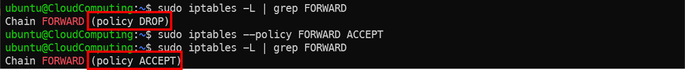

---

## 9. Namespace 간 통신 확인

지금까지 구성한 네트워크가 올바르게 동작하는지 `ping`으로 두 네임스페이스가 서로 통신되는지 확인합니다.

```bash
# ping 테스트를 통해 ns1 → ns2 통신 확인
sudo ip netns exec ns1 ping -c 1 192.168.1.3
```

```bash
# ping 테스트를 통해 ns2 → ns1 통신 확인
sudo ip netns exec ns2 ping -c 1 192.168.1.2
```

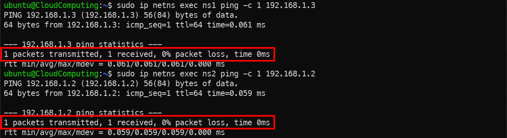

---

## 10. NAT 설정(외부 네트워크와의 통신)

지금까지는 네임스페이스끼리만 통신할 수 있었습니다. 이번에는 네임스페이스가 사용하는 사설 IP를 호스트의 IP로 변환(`NAT`)하여 외부 네트워크와도 통신할 수 있도록 설정합니다. 이를 위해 브릿지에 게이트웨이 역할을 할 IP를 부여하고, 커널 패킷 포워딩을 활성화한 뒤 `iptables`로 NAT 및 포워딩 규칙을 추가합니다.

> 명령의 `<인터넷 인터페이스>` 부분은 호스트가 실제 외부 통신에 사용하는 인터페이스(예: `ens3`) 이름으로 바꿔서 입력해야 합니다.

```bash
# 브릿지 인터페이스에 IP 할당
sudo ip addr add 192.168.1.1/24 dev br0

# IP가 제대로 할당되었는지 확인
ip addr show br0
```

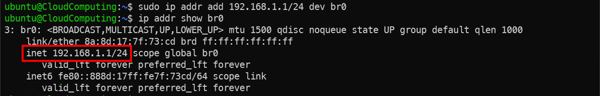

```bash
# ip_forwarding 설정 확인(0이면 비활성, 1이면 활성)
cat /proc/sys/net/ipv4/ip_forward

# 커널 포워딩 활성화(재부팅 시 0으로 초기화 됨)
sudo sysctl -w net.ipv4.ip_forward=1
```

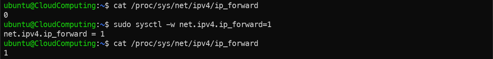

```bash
# NAT 규칙 설정: 내부 패킷이 외부로 나갈 때 호스트 IP로 변환
# 192.168.1.0/24 대역에서 <인터넷 인터페이스>를 통해서 나가는 모든 패킷에 대해 NAT 적용
sudo iptables -t nat -A POSTROUTING -s 192.168.1.0/24 -o <인터넷 인터페이스> -j MASQUERADE

# 포워딩 규칙 설정
# 내부에서 외부로 나가는 모든 패킷 허용(br0 -> ens3 -> 외부)
sudo iptables -A FORWARD -i br0 -o <인터넷 인터페이스> -j ACCEPT

# 외부에서 들어오는 응답 패킷 허용(내부에서 보낸 요청에 대한 응답만 허용, 외부 -> ens3 -> br0)
sudo iptables -A FORWARD -i <인터넷 인터페이스> -o br0 -m conntrack --ctstate RELATED,ESTABLISHED -j ACCEPT

```

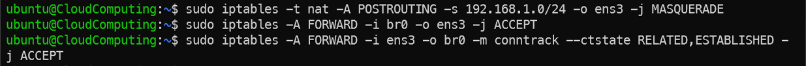

### 설정 확인

```bash
# NAT 규칙 확인
sudo iptables -t nat -L -n -v

# FORWARD 규칙 확인
sudo iptables -L -n -v
```

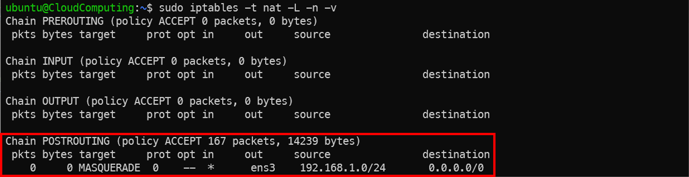
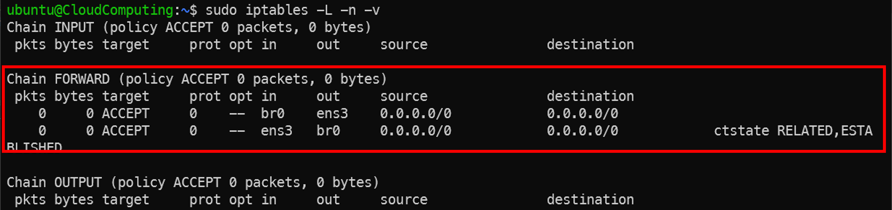

### 참고
- `ip_forward`는 호스트가 서로 다른 인터페이스 사이에서 패킷을 전달하도록 허용하는 커널 설정값, 값이 1로 활성화되지 않으면 NAT나 방화벽 규칙이 존재하더라도 인터페이스 간 패킷 전달이 이루어지지 않음  

- `NAT (MASQUERADE)`는 내부 사설 IP를 외부 통신이 가능한 호스트 IP로 변환하는 SNAT 방식의 주소 변환 기술, 사설 IP는 인터넷에서 직접 라우팅되지 않기 때문에 외부와 통신할 때 출발지 주소를 호스트 IP로 변환하여 응답 패킷이 다시 호스트로 돌아오도록 처리  

- `iptables FORWARD` 체인은 호스트를 통과하여 다른 네트워크로 전달되는 패킷을 제어하는 체인, 패킷이 들어오는 인터페이스(`-i`)와 나가는 인터페이스(`-o`)를 기준으로 패킷 전달 경로를 제어함  

- `-m conntrack`은 패킷의 연결 상태를 기반으로 필터링을 수행하는 모듈, 내부에서 먼저 시작된 통신의 응답 패킷(`RELATED`, `ESTABLISHED`)만 허용하여 외부에서 임의로 시작되는 연결을 차단하는 역할을 수행함  

- `NAT`와 `FORWARD` 규칙에서 `-s`는 패킷의 출발지(Source) IP 주소 조건, `-d`는 패킷의 목적지(Destination) IP 주소 조건을 지정하는 옵션임 규칙이 적용될 트래픽 범위를 명확하게 제한할 때 사용됨  

| 구분 | `-s` (Source, 출발지) | `-d` (Destination, 목적지) |
| :--- | :--- | :--- |
| **NAT (주소 변환)** | SNAT 대상이 되는 내부 네트워크 대역 지정 | DNAT 시 트래픽이 전달될 내부 IP 지정 |
| **FORWARD (패킷 전달 허용)** | 특정 출발지 IP 또는 네트워크 대역 조건 지정 | 특정 목적지 IP 또는 네트워크 대역 조건 지정 |

## 11. Default Route 설정

NAT 규칙을 설정했더라도 네임스페이스 내부에는 외부로 나가는 경로 정보가 없습니다. 따라서 자신이 직접 연결된 대역 외의 목적지로 패킷을 보내려면, 게이트웨이(브릿지 IP)를 기본 경로(`Default Route`)로 지정해 주어야 합니다.

먼저 설정 전에는 외부와 통신이 되지 않는 것을 확인합니다.

```bash
# 외부 네트워크 연결 확인
sudo ip netns exec ns1 ping -c 1 8.8.8.8

sudo ip netns exec ns2 ping -c 1 8.8.8.8
```

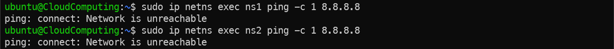

```bash
# ns1 default route 설정
sudo ip netns exec ns1 ip route add default via 192.168.1.1 dev eth0

# default route가 제대로 설정되었는지 확인
sudo ip netns exec ns1 ip route show dev eth0
```

```bash
# ns2 default route 설정
sudo ip netns exec ns2 ip route add default via 192.168.1.1 dev eth0

# default route가 제대로 설정되었는지 확인
sudo ip netns exec ns2 ip route show dev eth0
```


### 외부 Ping 테스트

```bash
# 외부 네트워크 연결 확인
sudo ip netns exec ns1 ping -c 1 8.8.8.8

sudo ip netns exec ns2 ping -c 1 8.8.8.8
```

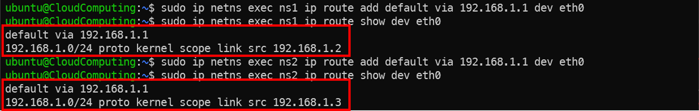

### 참고
- `Default Route`는 라우팅 테이블에 없는 목적지로 패킷을 보낼 때 사용하는 기본 경로 (`0.0.0.0/0`)  

- `Namespace`는 기본적으로 외부 네트워크로 나가는 경로가 없기 때문에 게이트웨이를 Default Route로 지정해야 외부 통신이 가능함  

- `ip route add default via <gateway>`는 외부 네트워크로 나갈 때 사용할 게이트웨이를 설정하는 명령  

- `Default Route`가 없으면 네임스페이스는 자신이 직접 연결된 네트워크 대역 외의 목적지로 패킷을 보낼 수 없음

---

## 12. DNS 설정

앞 단계까지 진행하면 외부 IP 주소에는 접근할 수 있지만, 도메인 이름은 사용할 수 없습니다. 네임스페이스 내부에 도메인 이름을 IP로 변환해 줄 `DNS` 서버가 지정되어 있지 않기 때문입니다. 이 단계에서는 네임스페이스 내부에 DNS 서버를 설정합니다.

### 테스트

DNS 설정 전에는 도메인 이름으로 통신이 되지 않는 것을 먼저 확인합니다.

```bash
# DNS 설정 전 테스트
sudo ip netns exec ns1 ping -c 1 google.com
```


---

### DNS 서버 설정

```bash
# Namespace 내부 DNS 서버 설정
sudo ip netns exec ns1 sed -i '/nameserver/c\nameserver 8.8.8.8' /etc/resolv.conf
sudo ip netns exec ns2 sed -i '/nameserver/c\nameserver 8.8.8.8' /etc/resolv.conf

# 설정 확인
sudo ip netns exec ns1 cat /etc/resolv.conf | grep nameserver
sudo ip netns exec ns2 cat /etc/resolv.conf | grep nameserver
```

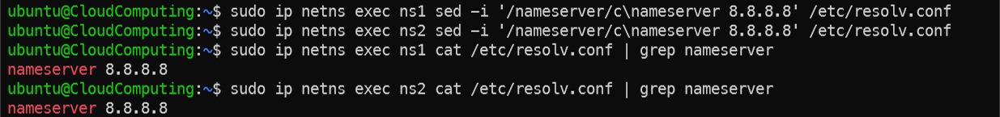

### 다시 테스트

```bash
# DNS 설정 후 테스트
sudo ip netns exec ns1 ping -c 1 google.com
sudo ip netns exec ns2 ping -c 1 google.com
```

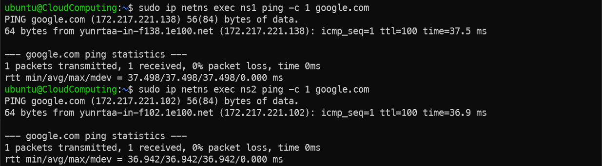

### 참고 - sudo: unable to resolve host <호스트이름>: Temporary failure in name resolution 오류 해결법

```bash
# /etc/hosts 파일의 IP 주소에 호스트이름 매핑
sudo sed -i "/127.0.0.1 localhost/ s/$/ $(hostname)/" /etc/hosts
```

---

## 13. 유사 컨테이너 환경에 Network Namespace 적용해보기

앞서 다룬 [유사 컨테이너 환경 구축](../4-ContainerTechnology/ContainerTechnology.md#11-cgroup-및-namespace-기반-유사-컨테이너-환경-구축)에 Network Namespace를 적용하여, 컨테이너와 유사한 환경에 격리된 네트워크를 직접 붙여 봅니다.

`cgroup` 및 `rootfs`는 컨테이너 기술 실습에서 만든 `mycontainer` cgroup과 `$CROOT` 경로를 그대로 활용합니다.

```bash
# $CROOT 재설정
export CROOT=/tmp/container-root
```

```bash
# ip, ping 바이너리 복사
sudo cp -vL /usr/sbin/ip $CROOT/bin/ip
sudo cp -vL /usr/bin/ping $CROOT/bin/ping
```

```bash
# unshare 명령어 입력 시 -n 을 통해 네트워크 네임스페이스 격리
sudo unshare -pmnif bash

# unshare 안에서 CROOT 재설정
export CROOT=/tmp/container-root

# $CROOT/proc 마운트
mount -t proc proc $CROOT/proc

# root filesystem 변경
chroot $CROOT /bin/bash

# ip 명령어 테스트
ip a
```

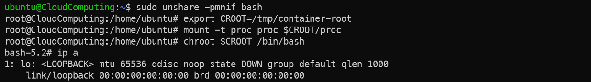

`unshare`로 격리 시 `ip netns list`를 통해 네트워크 네임스페이스를 확인할 수 없음  
컨테이너 기술 실습 때와 같이 `PID`를 통해 네임스페이스에 접근할 것

```bash
# 새로운 쉘에서 Namespace 내부 프로세스의 PID 확인
CONT_PID=$(pgrep -n bash)

# veth pair 생성 및 한쪽을 컨테이너(CONT_PID)로 이동
sudo ip link add veth-cont type veth peer name eth0 netns $CONT_PID

# 호스트 쪽 인터페이스(veth-cont)를 브릿지에 연결 및 활성화
sudo brctl addif br0 veth-cont
sudo ip link set veth-cont up
```

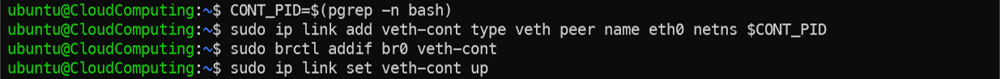

```bash
# chroot 쉘에서 실행
# 인터페이스 확인 및 활성화
ip a

ip link set lo up
ip link set eth0 up

# IP 주소 할당 및 기본 게이트웨이 설정
ip addr add 192.168.1.100/24 dev eth0
ip route add default via 192.168.1.1

# IP 주소 할당 및 게이트웨이 설정 확인
ip addr show eth0
ip route show 
```

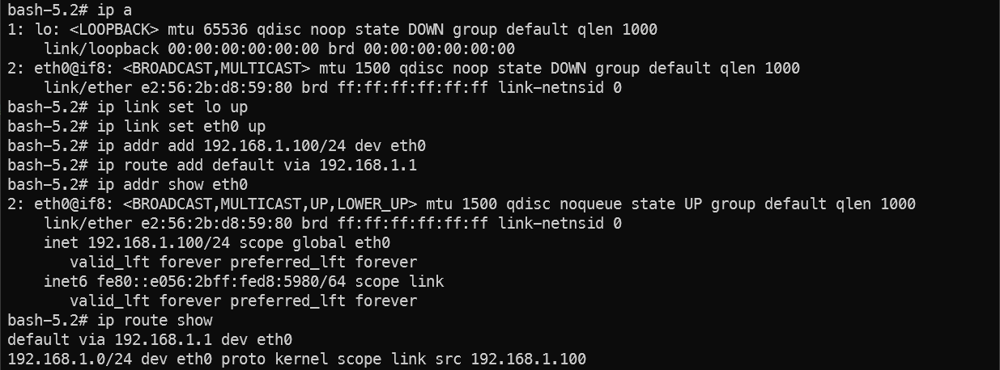

```bash
# 외부와 통신 테스트
ping -c 1 8.8.8.8
```

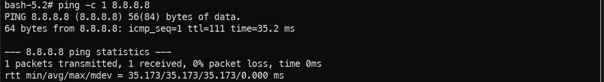

---

## 14. 심화 과제 - OVS 기반 네트워크 구성 해보기

앞선 실습에서는 `Linux Bridge`를 기반으로 네트워크를 구성하였습니다.

심화 내용으로, Linux Bridge 대신 **Open vSwitch(OVS)** 를 이용하여 동일한 네트워크 환경을 구성해 봅니다. OVS는 다양한 기능과 흐름 제어를 지원하는 가상 스위치로, 클라우드 환경에서 널리 사용됩니다.

---

## Q & A

박찬욱  
cupark@dankook.ac.kr  

남재현  
namjh@dankook.ac.kr  

## Networked Systems and Security Lab (BoanLab) @ DKU

