# 클라우드 가상화 기술

## 스토리지 가상화 기술 실습

## 1. NFS 설치 및 운영

- 가상 머신 2개를 준비  
- 하나는 `NFS 서버`, 다른 하나는 `NFS 클라이언트`로 이용  

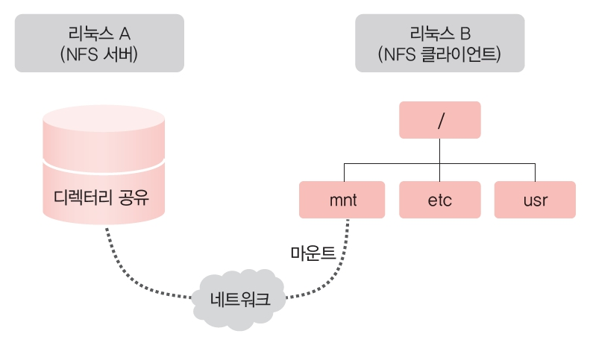

---

## 2. NFS 서버 설정

```bash
# NFS 서버로 이용할 호스트에서 수행

# 패키지 업데이트
sudo apt update

# NFS 서버 설치
sudo apt install -y nfs-kernel-server
```

```bash
# 공유할 디렉토리 생성
sudo mkdir -p /srv/nfs_share

# 디렉토리 소유자를 nobody:nogroup으로 변경
sudo chown nobody:nogroup /srv/nfs_share

# 모든 사용자가 읽기/쓰기/실행 가능하도록 권한 설정
sudo chmod 777 /srv/nfs_share

# 소유자 및 권한 확인
ls -ld /srv/nfs_share
```

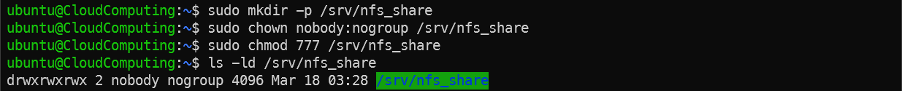

---

## 3. NFS 공유 설정

```bash
# /etc/exports 파일에 공유 디렉토리 설정 추가
echo "/srv/nfs_share *(rw,sync,no_subtree_check)" | sudo tee -a /etc/exports
```

### 참고
- `rw / ro`  
  - `rw` - NFS 서버 디렉토리에 대해 읽기/쓰기 허용
  - `ro` - NFS 서버 디렉토리에 대해 읽기 전용으로 허용  
  
- `sync / async`  
  - `sync` - 클라이언트가 파일을 작성/수정/삭제하면 데이터를 디스크에 기록한 뒤 응답
  - `async` - 클라이언트가 파일을 작성/수정/삭제하면 데이터를 메모리에만 저장한 뒤 응답  
    (성능 향상/데이터 손실 위험)

- `subtree_check / no_subtree_check`  
  - `subtree_check` - NFS 서버가 요청받은 파일이 실제 공유된 하위 디렉토리 내에 있는지 매번 검사  
    (보안 강화, 오버헤드 발생)
  - `no_subtree_check` - 파일의 개별 위치를 매번 엄밀하게 검증하지 않고 파일 시스템 단위로 접근 허용  
    (성능 향상, 연결 안정성 유리)

- `no_subtree_check`를 사용하는 이유  
  - 가상화 환경에서는 디스크 I/O가 물리 서버보다 느릴 수 있으므로 성능 최적화에 유리함  
  - 또한, 가상 머신이 자주 생성/삭제되는 환경에서는 디렉토리 구조가 자주 변경될 수 있으므로 `no_subtree_check`를 사용하여 연결 안정성을 높이는 것이 좋음

---

## 4. NFS 서버 적용

```bash
# NFS 서버 재시작
sudo systemctl restart nfs-kernel-server

# 현재 export 설정 확인
sudo exportfs -v
```

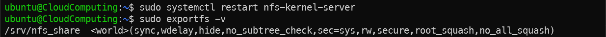

---

## 5. NFS 클라이언트 설정

```bash
# NFS 클라이언트로 이용할 호스트에서 수행

# 패키지 업데이트
sudo apt update

# NFS 클라이언트 패키지 설치
sudo apt install -y nfs-common
```

```bash
# 마운트할 디렉토리 생성
sudo mkdir -p /mnt/nfs_share

# NFS 서버의 공유 디렉토리를 클라이언트에 마운트
sudo mount [NFS Server IP]:/srv/nfs_share /mnt/nfs_share

# 마운트 확인
mount | grep nfs

ls -ld /mnt/nfs_share
```

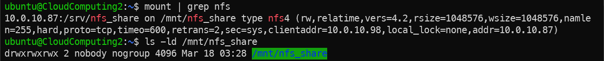

---

## 6. NFS 동작 확인

```bash
# 마운트된 디렉토리에 파일 생성 테스트
echo "Storage Virtualization" > /mnt/nfs_share/test.txt
```

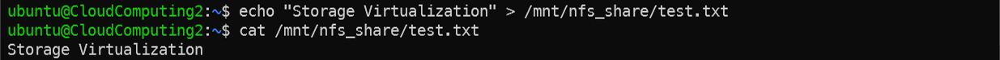


---

## 7. NFS 마운트 해제

```bash
# NFS 마운트 해제
sudo umount /mnt/nfs_share

# 마운트 해제 확인
mount | grep nfs

ls -l /mnt/nfs_share
```

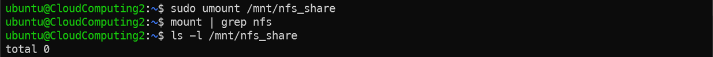

### 참고
- 생성한 `test.txt` 파일은 `NFS 서버`에 저장되어 있으므로, 마운트를 해제하면 해당 파일에 접근할 수 없음  

- NFS는 네트워크 기반 파일 시스템이므로 서버가 중지되거나 네트워크 연결이 끊기면 마운트된 디렉토리에 접근 시  
 지연 또는 오류 발생 가능   

- NFS는 클라이언트 재부팅 시 자동으로 마운트되지 않음  
  (`/etc/fstab` 파일에 NFS 마운트 설정 추가하여 자동 마운트 가능)  

- `umount` 시 `device is busy` 오류가 발생하면 해당 디렉토리를 사용하는 프로세스가 존재하는 것이므로 종료 후 다시 시도
  (`lsof +D /mnt/nfs_share` 또는 `fuser -m /mnt/nfs_share`로 확인 가능)  
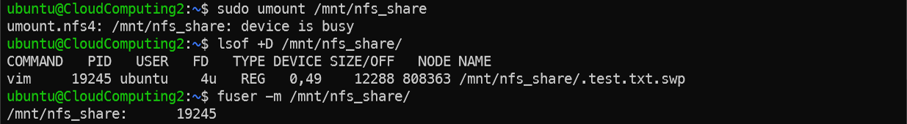

---

## 8. iSCSI 설치 및 운영

- 가상 머신 2개를 준비  
- 하나는 `iSCSI 서버`, 다른 하나는 `iSCSI Initiator`로 이용

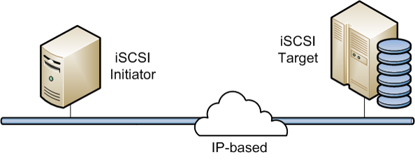

---

## 9. iSCSI 서버 설정

```bash
# iSCSI 서버로 이용할 호스트에서 수행

# 패키지 업데이트
sudo apt update

# iSCSI 타겟 서버 설치
sudo apt install -y tgt
```

```bash
# iSCSI 디스크 파일을 저장할 디렉토리 생성
sudo mkdir /srv/iscsi_disks

# 1GB 크기의 디스크 이미지 파일 생성
sudo dd if=/dev/zero of=/srv/iscsi_disks/disk01.img bs=1G count=1
```

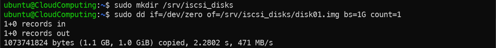

---

## 10. iSCSI 타겟 설정

```bash
# iSCSI 타겟 설정 파일 작성
# [Target IQN]은 iqn.2026-04.kr.ac.dankook:[학번]과 같이 고유하게 설정할 것
# [Initiator IP]는 후에 iSCSI Initiator를 설치할 호스트의 IP 주소로 설정할 것
sudo tee /etc/tgt/conf.d/iscsi-target.conf <<EOF
<target [Target IQN]>
  backing-store /srv/iscsi_disks/disk01.img
  initiator-address [Initiator IP]
</target>
EOF
```

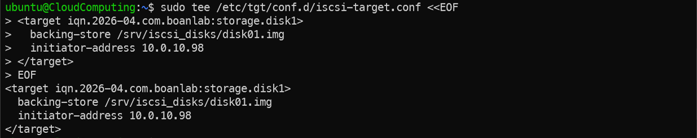

```bash
# iSCSI 서비스 재시작
sudo systemctl restart tgt

# 타겟 설정 확인
sudo tgtadm --mode target --op show
```

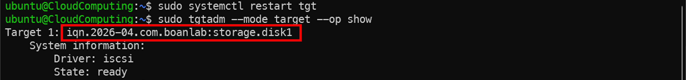

### 참고
- `iSCSI의 IQN(iSCSI Qualified Name)`은 고유한 식별자로, 전 세계적으로 중복되지 않아야 함  
  예: `iqn.2026-04.com.boanlab:storage.disk1`
  - `iqn` : iSCSI 규격을 의미하는 고정 문자열 (필수)
  - `2026-04` : 도메인 이름을 역순으로 표현한 날짜 (예: 2026년 4월)
  - `com.boanlab` : 조직의 도메인 이름을 역순으로 표현한 부분 (예: boanlab.com)
  - `storage.disk1` : 해당 타겟을 구분하기 위해 사용자가 정하는 이름

---

## 11. iSCSI Initiator 설정

```bash
# iSCSI Initiator로 이용할 호스트에서 수행

# 패키지 업데이트
sudo apt update

# iSCSI Initiator 설치
sudo apt install -y open-iscsi
```

```bash
# 타겟 서버 검색
sudo iscsiadm -m discovery -t sendtargets -p [Target IP]

# 검색된 타겟에 로그인
sudo iscsiadm -m node -T [Target IQN] -p [Target IP] --login
```

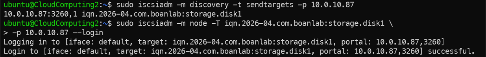


```bash
# 타겟 서버에서 Initiator의 로그인 상태 확인
sudo tgtadm --mode target --op show
```

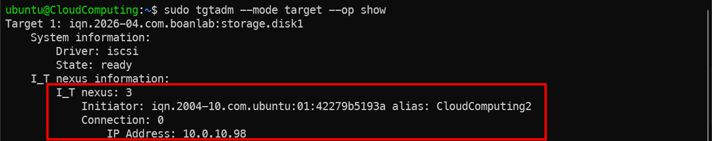

---

## 12. 연결된 디스크 확인

```bash
# 연결된 블록 디바이스 확인
lsblk
```

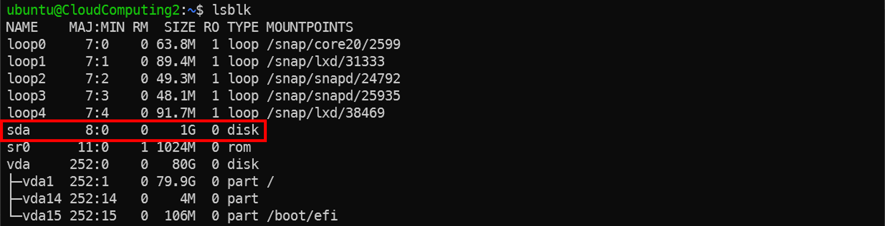
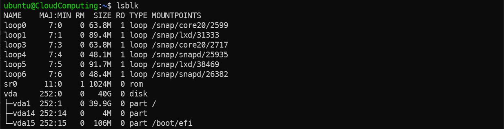

### 참고
- 타겟 서버 호스트에서는 `iSCSI 타겟`이 `디스크 이미지 파일`로 설정되어 있기 때문에, 실제 블록 디바이스로 나타나지 않음  
(`/srv/iscsi_disks/disk01.img` 파일로 존재)  

- Linux의 저장장치 네이밍 규칙
  - `sd` (SCSI Disk): SATA, SAS, USB 장치 및 iSCSI
  - `vd` (Virtio Disk): KVM/QEMU 같은 가상화 환경에서 Virtio 드라이버를 사용하는 가상 디스크
  - `nvme` (NVMe Disk): NVMe SSD 장치
  - `sr` (SCSI ROM): CD-ROM 또는 DVD-ROM 드라이브
  - 앞의 prefix를 붙인 후 알파벳과 숫자가 조합되어 디바이스 이름이 생성됨  
    (예: `sda`, `sdb`, `vda`, `nvme0n1` 등)

---

## 13. 디스크 포맷 및 마운트

```bash
# 연결된 디스크를 ext4 파일시스템으로 포맷
sudo mkfs.ext4 /dev/<디스크이름>

# 마운트할 디렉토리 생성
sudo mkdir /mnt/iscsi_disk

# 디스크를 마운트
sudo mount /dev/<디스크이름> /mnt/iscsi_disk

# /dev/<디스크이름>가 정상적으로 마운트되었는지 확인
mount | grep /dev/<디스크이름>

lsblk | grep <디스크이름>
```

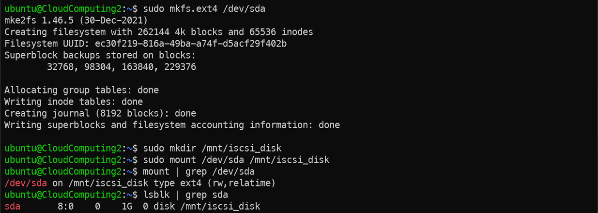

---

## 14. 디스크 사용 테스트

```bash
# 마운트 포인트의 소유자를 현재 사용자(ubuntu)로 변경
sudo chown ubuntu:ubuntu /mnt/iscsi_disk

# 모든 사용자에게 읽기/쓰기/실행 권한 부여
sudo chmod 777 /mnt/iscsi_disk

# 마운트된 디스크에 파일 생성 테스트
echo "iSCSI Storage Virtualization" > /mnt/iscsi_disk/test.txt

# 생성된 파일 확인
cat /mnt/iscsi_disk/test.txt

# 마운트된 디스크의 사용량 확인
df -h /mnt/iscsi_disk
```

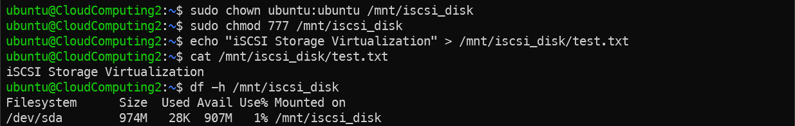

---

## 15. iSCSI 연결 해제

```bash
# Initiator 호스트에서 수행

# 디스크 마운트 해제
sudo umount /dev/<디스크이름>

# 디스크 마운트 해제 확인
mount | grep /dev/<디스크이름>

lsblk | grep <디스크이름>

# iSCSI 타겟 세션에서 로그아웃
sudo iscsiadm -m node -T [Target IQN] -p [Target IP] --logout

# 디스크가 완전히 해제되었는지 확인
lsblk
``` 

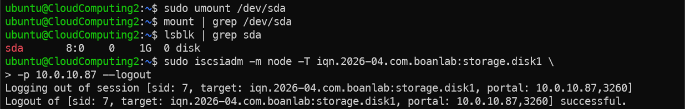
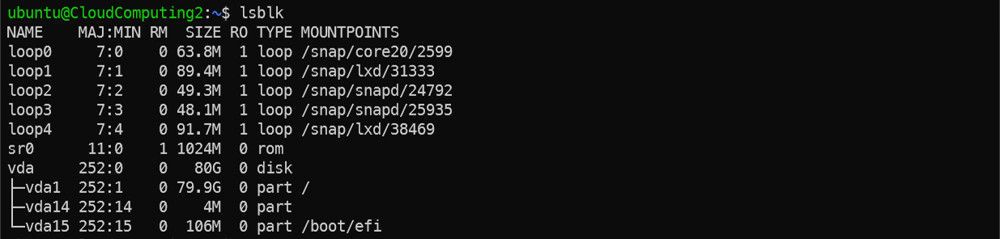

```bash
# 타겟 서버에서 Initiator의 로그인 상태 확인
sudo tgtadm --mode target --op show
```

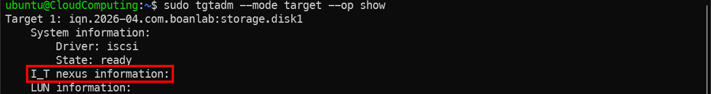

### 참고
- `umount` 시 `device is busy` 오류가 발생하면 [NFS에서 설명한 방법](#7-nfs-마운트-해제)과 같이 해결

---

## Q & A

박찬욱  
cupark@dankook.ac.kr

남재현  
namjh@dankook.ac.kr  

## Networked Systems and Security Lab (BoanLab) @ DKU
